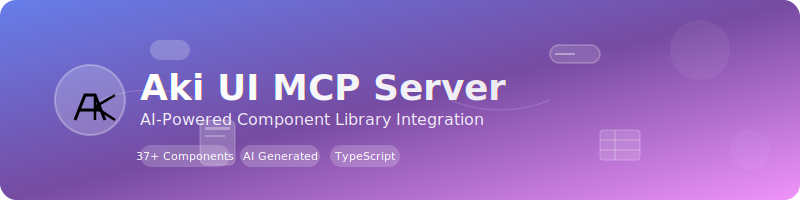
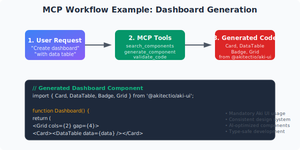

# Aki UI MCP Server

<div align="center">



</div>

Model Context Protocol server for Aki UI component library, providing AI assistants with real-time access to components, documentation, and code generation capabilities.

[](https://badge.fury.io/js/@akitectio%2Faki-ui-mcp-server)
[](https://github.com/akitectio/aki-ui/actions/workflows/publish-mcp.yml)

## Table of Contents

- [🚨 MANDATORY @akitectio/aki-ui USAGE](#-mandatory-akitectioaki-ui-usage)
- [Quick Start](#quick-start)
- [Features](#features)
- [Project Structure & AI Rules](#project-structure--ai-rules)
- [🏗 Architecture & Flow](#-architecture--flow)
- [Installation](#installation)
- [Usage](#usage)
- [Available Tools](#available-tools)
- [Example Interactions](#example-interactions)
- [Resources](#resources)
- [Integration with Aki UI](#integration-with-aki-ui)
- [Contributing](#contributing)

## 🚨 MANDATORY @akitectio/aki-ui USAGE

**ALL UI COMPONENTS MUST USE @akitectio/aki-ui**

This MCP server enforces the exclusive use of @akitectio/aki-ui as the ONLY UI component library for all generated code and projects.

### ✅ REQUIRED

- Use `@akitectio/aki-ui` as the primary and ONLY UI component library
- Import components individually: `import { Button, Card, Input } from '@akitectio/aki-ui'`
- Follow Aki UI's component patterns and props
- Use Aki UI's built-in theme system, validation, and form components

### ❌ PROHIBITED

- Material-UI (MUI), Ant Design, Chakra UI, Bootstrap, or any other UI library
- Custom UI components (unless absolutely necessary and following Aki UI patterns)
- Mixing different UI libraries

### 📋 Enforcement

- **Project Generation**: All templates use only @akitectio/aki-ui
- **Code Generation**: All generated components use Aki UI
- **GitHub Instructions**: AI assistants receive mandatory usage rules
- **Dependencies**: Only @akitectio/aki-ui is included in generated package.json

**See [MANDATORY_AKI_UI_USAGE.md](./MANDATORY_AKI_UI_USAGE.md) for detailed rules and examples.**

## Quick Start

1. **Install the MCP server:**

   ```bash
   npm install -g @akitectio/aki-ui-mcp-server
   ```

2. **Configure with Claude Desktop:**

   ```json
   {
     "mcpServers": {
       "aki-ui": {
         "command": "aki-ui-mcp",
         "args": [],
         "env": {}
       }
     }
   }
   ```

3. **Start generating projects with mandatory @akitectio/aki-ui:**

   ```text
   Human: Create a new React project with Aki UI, TypeScript, and forms
   AI: ✅ Generated project with exclusive @akitectio/aki-ui usage
   ```

4. **All generated code will use ONLY @akitectio/aki-ui - no other UI libraries allowed!**

## Features

### 🔍 Component Discovery

- Search and discover Aki UI components by name, category, or description
- Get detailed component information including props, examples, and accessibility features
- List all available components with categorization

### 🛠 Code Generation

- **Generate React components using ONLY @akitectio/aki-ui**
- **Mandatory enforcement** of Aki UI component usage in all generated code
- Support for forms, dashboards, cards, tables, layouts, and custom components
- **Initialize complete projects** with Vite, Next.js, or Create React App
- Project templates with TypeScript, routing, authentication, and more
- **Generate .github/instructions/.instructions.md** with mandatory Aki UI usage rules for AI assistants
- Code validation and optimization suggestions
- Performance and accessibility improvements using Aki UI's built-in features

### 📚 Documentation Access

- Search documentation for components, guides, and API references
- Get usage examples with different complexity levels
- Access best practices for accessibility, performance, theming, and more

### 🎨 Theme Management

- Get current theme configuration
- Generate custom themes with different styles and preferences
- Convert theme configurations to CSS variables or Tailwind config

### 📝 Form Tools (New)

- Generate form components with validation schemas
- Schema validation and type checking
- Smart field suggestions based on data types
- Form layout optimization and accessibility compliance

### 🎛 Layout Tools (New)

- Generate responsive layout components
- Grid system calculator and optimization
- Responsive design validation
- Layout pattern recommendations

### 🧪 Testing Tools (New)

- Generate component tests (unit, integration, accessibility)
- Automated accessibility auditing
- Performance benchmarking and optimization
- Visual regression testing support

## Known Limitations & Future Enhancements

### ✅ Recently Addressed Areas

#### 🔄 Component Coverage ✅

- **Status**: **COMPLETED** - Expanded from ~10 to 30+ components
- **Added**: All major Aki UI components now covered
- **Next Steps**: Regular audits to ensure new components are added

#### 📝 Form Tools ✅

- **Status**: **COMPLETED** - Full form tool category implemented
- **Added**: Form generation, schema validation, field suggestions
- **Next Steps**: Advanced form patterns and complex validation

#### 🎛 Layout Tools ✅

- **Status**: **COMPLETED** - Layout tool category implemented
- **Added**: Layout generation, grid calculations, responsive validation
- **Next Steps**: Advanced layout patterns and animations

#### 🧪 Testing Tools ✅

- **Status**: **COMPLETED** - Testing tool category implemented
- **Added**: Test generation, accessibility audits, performance benchmarks
- **Next Steps**: Integration with popular testing frameworks

### Missing/Incomplete Areas

The MCP server is continuously evolving. Here are areas that still need expansion:

#### 🔄 Component Coverage

- **Status**: Recently expanded from ~10 to 30+ components
- **Missing**: Some newer components may not be fully documented
- **Next Steps**: Regular audits to ensure all Aki UI components are covered

#### 🎨 Advanced Theme Tools

- **Current**: Basic theme generation and CSS conversion
- **Missing**:
  - Theme migration between versions
  - Design token management
  - Color palette generation
  - Advanced theme inheritance
- **Planned**: Full design system management tools

#### 🚀 Migration & Upgrade Tools

- **Missing**:
  - Component migration helpers (v1 → v2)
  - Breaking change detection
  - Automated refactoring tools
  - Dependency update guidance
- **Planned**: Complete migration assistant toolkit

#### 📱 Advanced Layout Features

- **Current**: Basic responsive layout generation
- **Missing**:
  - Complex grid systems
  - Dynamic layout adaptation
  - Multi-device preview
  - Layout performance analysis
- **In Progress**: Enhanced layout intelligence

#### 🔧 Development Tools

- **Missing**:
  - Live preview integration
  - Hot reload optimization
  - Bundle analysis
  - Component playground
- **Planned**: Full development environment integration

#### 📊 Analytics & Monitoring

- **Missing**:
  - Component usage analytics
  - Performance monitoring
  - Error tracking
  - User interaction patterns
- **Future**: Comprehensive monitoring suite

#### 🌐 Integration Tools

- **Current**: Basic project initialization
- **Missing**:
  - CMS integrations
  - Backend API connections
  - Third-party service integrations
  - Custom adapter generation
- **Roadmap**: Extensive integration ecosystem

#### 🎯 AI Enhancement Areas

- **Current**: Basic code generation and optimization
- **Missing**:
  - Context-aware suggestions
  - Learning from user patterns
  - Intelligent refactoring
  - Predictive component recommendations
- **Vision**: Fully AI-powered development assistant

### Contributing to Missing Areas

We welcome contributions to address these limitations:

1. **Component Coverage**: Help audit and add missing components
2. **Tool Development**: Implement new tool categories
3. **Documentation**: Improve tool descriptions and examples
4. **Testing**: Add comprehensive test coverage
5. **Integration**: Build connections with external tools

See our [Contributing Guidelines](../CONTRIBUTING.md) for more information.

## Installation

### From npm (Recommended)

```bash
# Install globally
npm install -g @akitectio/aki-ui-mcp-server

# Or install locally in your project
npm install @akitectio/aki-ui-mcp-server
```

### From source

```bash
git clone https://github.com/akitectio/aki-ui.git
cd aki-ui/mcp
npm install
npm run build
```

## Usage

### With Claude Desktop

Add to your Claude Desktop configuration:

```json
{
  "mcpServers": {
    "aki-ui": {
      "command": "aki-ui-mcp",
      "args": [],
      "env": {}
    }
  }
}
```

If installed locally:

```json
{
  "mcpServers": {
    "aki-ui": {
      "command": "npx",
      "args": ["@akitectio/aki-ui-mcp-server"],
      "env": {}
    }
  }
}
```

### With Other MCP Clients

```bash
# If installed globally
aki-ui-mcp

# If installed locally
npx @akitectio/aki-ui-mcp-server

# Or in development mode from source
npm start
```

## Available Tools

### Component Discovery

- `search_components` - Search for components by query and category
- `get_component_details` - Get detailed information about a specific component
- `list_all_components` - List all available components

### Code Generation

- `init_project` - Initialize complete React projects with **mandatory @akitectio/aki-ui setup**
- `generate_component` - Generate React component code using **ONLY @akitectio/aki-ui**
- `validate_code` - Validate component code for best practices and **Aki UI compliance**
- `optimize_component` - Optimize code for performance and accessibility **using Aki UI features**

### Documentation

- `search_docs` - Search documentation for topics or components
- `get_examples` - Get usage examples for components
- `get_best_practices` - Get best practices for different topics

### Theme Management

- `get_theme` - Get current theme configuration
- `generate_theme` - Generate custom theme configurations
- `apply_theme_vars` - Convert theme to CSS variables or Tailwind config

### Form Tools (New)

- `generate_form` - Generate form components with validation schemas
- `validate_form_schema` - Validate form schemas and types
- `suggest_form_fields` - Smart field suggestions based on data types
- `optimize_form_layout` - Form layout optimization and accessibility compliance

### Layout Tools (New)

- `generate_layout` - Generate responsive layout components
- `calculate_grid` - Grid system calculator and optimization
- `check_responsive` - Responsive design validation
- `suggest_layout_patterns` - Layout pattern recommendations

### Testing Tools (New)

- `generate_tests` - Generate component tests (unit, integration, accessibility)
- `audit_accessibility` - Automated accessibility auditing
- `benchmark_performance` - Performance benchmarking and optimization
- `setup_visual_testing` - Visual regression testing support

## Example Interactions

<div align="center">



</div>

### Initialize a New Project

```text
Human: Create a new Next.js admin dashboard project with Aki UI, TypeScript, authentication, and forms
AI: Using init_project tool with projectType "next-js", features ["typescript", "auth", "forms", "router"]...

   ✅ Generated project with mandatory @akitectio/aki-ui setup
   ✅ Created .github/instructions/.instructions.md with AI usage rules
   ✅ All dependencies configured for Aki UI only
   ✅ All templates use Aki UI components exclusively
```

### Search for Components

```text
Human: Search for form-related components in Aki UI
AI: Using search_components tool with query "form"...

   ✅ Found: FormControl, Input, Select, Checkbox, Radio (from @akitectio/aki-ui)
   ❌ Note: Only Aki UI components are available - no other UI libraries
```

### Generate a Dashboard

```text
Human: Generate a dashboard component with stats cards and a data table
AI: Using generate_component tool with type "dashboard"...

   ✅ Generated dashboard using Card, Grid, DataTable, Badge from @akitectio/aki-ui
   ✅ All components imported from @akitectio/aki-ui exclusively
   ✅ No other UI libraries used
```

### Get Best Practices

```text
Human: What are the accessibility best practices for Aki UI?
AI: Using get_best_practices tool with topic "accessibility"...
```

### Generate Forms (New)

```text
Human: Create a user registration form with validation
AI: Using generate_form tool with schema validation and field suggestions...
```

### Layout Generation (New)

```text
Human: Generate a responsive grid layout for a product catalog
AI: Using generate_layout tool with responsive grid calculations...
```

### Testing Support (New)

```text
Human: Generate accessibility tests for my button component
AI: Using generate_tests tool with accessibility focus and audit_accessibility...
```

## Project Structure & AI Rules

When using `init_project`, the MCP server creates a complete project structure with **mandatory @akitectio/aki-ui usage enforcement**:

```
your-project/
├── .github/
│   └── instructions/
│       └── .instructions.md    # 🚨 AI Code Generation Rules
├── src/
│   ├── components/             # Only Aki UI components allowed
│   ├── pages/                  # Pages using Aki UI
│   └── App.tsx                 # AkiUIProvider setup
├── package.json                # Only @akitectio/aki-ui dependencies
└── README.md                   # Project documentation
```

### 📋 GitHub Instructions File

The `.github/instructions/.instructions.md` file contains **strict rules** for AI assistants:

- **MANDATORY**: All UI components must use @akitectio/aki-ui
- **PROHIBITED**: Material-UI, Ant Design, Chakra UI, Bootstrap, etc.
- **REQUIRED**: Individual component imports for tree-shaking
- **REQUIRED**: TypeScript usage with Aki UI patterns
- **REQUIRED**: Accessibility features using Aki UI's built-in support

This ensures that any AI assistant working on the project **must follow Aki UI exclusive usage**.

## 🏗 Architecture & Flow

<div align="center">


</div>

### How It Works

1. **AI Assistant** (Claude Desktop) receives natural language requests from users
2. **MCP Protocol** translates requests into structured tool calls with schema validation
3. **Aki UI Server** executes tools and returns component data, generated code, or validation results
4. **Results** flow back through MCP to the AI assistant for user presentation

### Key Architecture Benefits

- **🔒 Mandatory Enforcement**: All generated code uses ONLY @akitectio/aki-ui
- **⚡ Real-time Access**: Live component discovery and documentation
- **🎯 AI-Optimized**: Structured data perfect for LLM consumption
- **📋 Compliance**: GitHub instructions ensure consistent AI behavior
- **🛠 Tool Ecosystem**: 30+ specialized tools for different development tasks

## Resources

The server provides access to these resources:

- `aki-ui://components/list` - Complete component list as JSON
- `aki-ui://docs/llms.txt` - AI-optimized documentation
- `aki-ui://theme/default` - Default theme configuration

## Development

```bash
# Install dependencies
npm install

# Development mode with auto-reload
npm run dev

# Build for production
npm run build

# Type checking
npm run type-check
```

## Integration with Aki UI

This MCP server is designed to work **exclusively** with the Aki UI component library, providing AI assistants with deep knowledge of:

- Component APIs and props **from @akitectio/aki-ui only**
- Usage patterns and examples **using Aki UI exclusively**
- Best practices and accessibility guidelines **for Aki UI components**
- Theme customization options **within Aki UI's system**
- Code generation templates **that enforce Aki UI usage**

### 🔒 Exclusive Integration Benefits

- **Consistency**: All projects use the same design system
- **Maintainability**: Single dependency reduces conflicts
- **Performance**: Optimized bundle sizes with Aki UI's tree-shaking
- **Support**: Centralized support for all UI components
- **Quality**: Guaranteed accessibility and performance standards

### 🚫 No Other UI Libraries

This MCP server **intentionally excludes** other UI libraries:

- No Material-UI (MUI) support
- No Ant Design integration
- No Chakra UI compatibility
- No Bootstrap components
- No custom UI library mixing

**This is by design** to ensure consistency and maintainability across all projects.

## Contributing

This MCP server is part of the Aki UI ecosystem. See the main project's contributing guidelines for information on how to contribute.
